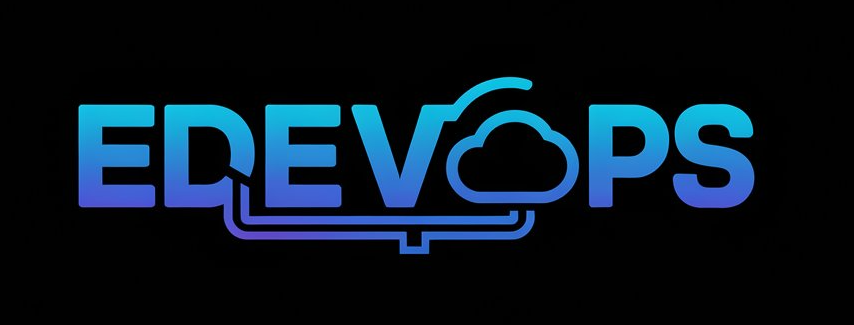

  

<table>
  <tr>
    <td width="58%" valign="top">
      

        <h2>Iae, beleza? Me chamo Ed 👋</h2>
        
Sou DevOps / SRE focado em confiabilidade, automacao e operacao de plataformas em ambientes criticos.

        
Trabalho conectando desenvolvimento, infraestrutura e negocio para entregar sistemas mais estaveis, escalaveis e observaveis.

        <ul align="left">
          <li>☁️ Atuo com cloud, Kubernetes, IaC e observabilidade</li>
          <li>🛠️ Base em suporte, redes e ambientes de producao</li>
          <li>⚙️ Foco em automacao, confiabilidade e entrega continua</li>
        </ul>
        
      

    </td>
    <td width="42%" valign="top" align="center">
      
    </td>
  </tr>
</table>

## GitHub em resumo

  
Um resumo rapido do meu perfil, das minhas entregas e das tecnologias que acompanham meu dia a dia.

  
  

## Stack

Abaixo reuno as ferramentas com as quais ja tive contato e experiencia pratica.

### Programacao

  
  
  
  
  

### Bancos de dados

  
  
  
  

### Plataforma e Operacao

  
  
  

### Automacao e Orquestracao

  
  

### Seguranca e Segredos

  
  

### ITSM e Operacao

  
  
  

### Cloud e Infraestrutura

  
  
  
  

### Observabilidade

  
  
  
  

### Agile

  
  
  
  

### CI/CD

  
  
  
  

